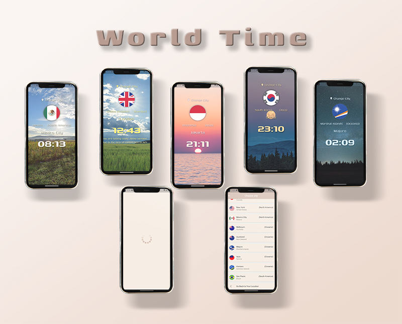

<!-- The project app is called Wallkerrr. It is an app that makes walking more exciting by adding an rpg element to it.-->

<a name="readme-top"></a>

<br />
<div align="center">

[![Contributors][contributors-shield]][contributors-url]
[![Forks][forks-shield]][forks-url]
[![Stargazers][stars-shield]][stars-url]
[![Issues][issues-shield]][issues-url]
[![MIT License][license-shield]][license-url]
[![LinkedIn][linkedin-shield]][linkedin-url]

<!-- PROJECT LOGO -->
<br />

<h1 align="center">WORLD TIME</h1>

  <p align="center">
    Learning Flutter: mobile app showing time in different locations in the world.<br /> April 2023.
    <br />
    <br />
    <a href="https://flutter-world-time.netlify.app/">View demo</a>
    ·
    <a href="https://github.com/jackharbon/flutter_world_time/issues">Report Bug</a>
    ·
    <a href="https://github.com/jackharbon/flutter_world_time/issues">Request Feature</a>
  </p>
</div>
<!-- TABLE OF CONTENTS -->
<details>
  <summary>Table of Contents</summary>
  <ul>
    <li>
      <a href="#about-the-project">About The Project</a>
      <ul>
        <li><a href="#app-description">App Description</a></li>
        <li><a href="#built-with">Built With</a></li>
      </ul>
    </li>
    <li>
      <a href="#getting-started">Getting Started</a>
      <ul>
        <li><a href="#prerequisites">Prerequisites</a></li>
        <li><a href="#installation">Installation</a></li>
      </ul>
    </li>
    <li><a href="#license">License</a></li>
    <li><a href="#contact">Contact</a></li>
    <li><a href="#acknowledgments">Acknowledgments</a></li>
  </ul>
</details>
<br />

<!-- ABOUT THE PROJECT -->

# About The Project



## App Description

World Time is a simple android showing current time in different locations.

After opening the app the users will see a current time in their location (based on his IP), then they can choose other city from the given list. Each time of a day presents different background:

-  sunrise
-  midday
-  sunset
-  midnight
-  late night

In case of lack of internet connection app shows demo static version with examples of:

-  country flag
-  country
-  continent
-  city
-  time

<p align="right">(<a href="#readme-top">back to top</a>)</p>

## Built With

| Coding                                           | Front-end                              |
| ------------------------------------------------ | -------------------------------------- |
| version control, code editing                    | framework and language                 |
| [![VSC][visualstudiocode]][visualstudiocode-url] | [![Flutter][flutter.dev]][flutter-url] |
| [![GitHub][github.com]][github-url]              | [![Dart][dart.dev]][dart-url]          |

<p align="right">(<a href="#readme-top">back to top</a>)</p>

<!-- GETTING STARTED -->

# Getting Started

Feel free to test the app for yourself (excluding commercial purposes).

## Prerequisites

To run the app you need a few pieces of software. The installation process will depend on your computer operating system (Linux, Mac OS, MS Windows), so I have included general instructions, for more detailed steps you need to read the software provider's instructions (docs) for the specific system. And also I DO NOT recommend using [WSL](https://learn.microsoft.com/en-us/windows/wsl/about) (Windows Subsystem for Linux), because of the problems with Android emulation, as WSL does not support GUI applications and SDK for Windows do not work with WSL.

Install useful software:

-  JavaScript runtime environment [Node.js](https://nodejs.org/en/)
-  Source code editor like [Visual Studio Code](https://code.visualstudio.com/Download)
-  Android SDK with emulator [Android Studio](https://developer.android.com/studio#downloads)
-  You may want to install desktop verion of [GitHub](https://desktop.github.com/)

<p align="right">(<a href="#readme-top">back to top</a>)</p>

## Installation

### I. Host this project locally

1. Register your account on GitHub, read this [Docs](https://docs.github.com/en/get-started/quickstart/set-up-git) for settting up Git.
2. Use "Fork" button in the top right corner of this page to copy this repository to your account.
3. You can leave the repository name as it is, click the green button "Create fork".
4. Open a modal window by clicking the green button "<> Code" and copy the link to your fork which looks like this: `https://github.com/your_github_name/flutter_world_time.git`
5. Open your Terminal (for Windows read [this](https://github.com/microsoft/terminal) and [this](https://learn.microsoft.com/en-us/windows/terminal/)) and navigate `cd /path/to/folder` to your projects folder.

### II. Set up front-end

1. Cloning repo

-  Clone repository to your computer (change `your_github_name` to your actual GitHub login)
   ```sh
   git clone https://github.com/your_github_name/flutter_world_time.git
   ```
-  Navigate to repo folder
   ```sh
   cd flutter_world_time
   ```
-  Open Visual Studio Code

   ```sh
   code .
   ```

2. Preparations

-  Install [Flutter](https://docs.flutter.dev/get-started/install) on your computer.
-  Install Flutter extension from the [Visual Studio Code Marketplace](https://marketplace.visualstudio.com/items?itemName=Dart-Code.flutter) or by searching within VS Code. The Dart extension will be installed automatically, if not already installed.

3. Emulating the app

-  [Connect your mobile phone using USB](https://learn.microsoft.com/en-us/microsoft-edge/devtools-guide-chromium/remote-debugging/) cable or [use an emulator](https://www.geeksforgeeks.org/how-to-run-a-flutter-app-on-android-emulator/) and type in the commands in the terminal.
-  Navigate to front-end directory
   ```sh
   cd world_time
   ```
-  Install updates
   ```sh
   flutter pub get
   ```
   ```sh
   flutter upgrade
   ```
-  Check Flutter installation
   ```sh
   flutter doctor
   ```
-  You can additionally check connected devices
   ```sh
   flutter devices
   ```
-  Run Flutter and wait for the app to install
   ```sh
   flutter run
   ```
   Wait a few minutes for the app to install.<br />
   Your World Time app is ready to play.<br  />
   You can read [how to use emulator in Visual Studio Code](https://dev.to/dailydevtips1/running-a-flutter-app-on-ios-and-android-emulators-3h33).

<p align="right">(<a href="#readme-top">back to top</a>)</p>

<!-- LICENSE -->

# License

GNU GENERAL PUBLIC LICENSE, see <a href="https://github.com/jackharbon/flutter_world_time/blob/main/LICENSE">`LICENSE.txt` </a> for more information.

<p align="right">(<a href="#readme-top">back to top</a>)</p>

<!-- CONTACT -->

# Contact

Jacek Harbon - [@JacekHarbon](https://twitter.com/JacekHarbon) - jacek@harbon.uk

Project Link: [https://github.com/jackharbon/flutter_world_time](https://github.com/jackharbon/flutter_world_time)

<p align="right">(<a href="#readme-top">back to top</a>)</p>

<!-- ACKNOWLEDGMENTS -->

# Acknowledgments

-  [Node.js](https://nodejs.org/en/)
-  [NPM.js](https://www.npmjs.com/)
-  [Fluter](https://flutter.dev/)
-  [Dart](https://dart.dev/guides/language/language-tour)
-  [Dart Pad](https://www.dartpad.dev/?)
-  [Visual Studio Code](https://code.visualstudio.com/)
-  [Android Studio](https://developer.android.com/studio)
-  [Material Design](https://m3.material.io/)
-  [Netlify](https://app.netlify.com/signup/start)

<p align="right">(<a href="#readme-top">back to top</a>)</p>

<!-- MARKDOWN LINKS & IMAGES -->
<!-- https://www.markdownguide.org/basic-syntax/#reference-style-links -->

[contributors-shield]: https://img.shields.io/github/contributors/jackharbon/flutter_world_time.svg?style=for-the-badge
[contributors-url]: https://github.com/jackharbon/flutter_world_time/graphs/contributors
[forks-shield]: https://img.shields.io/github/forks/jackharbon/flutter_world_time.svg?style=for-the-badge
[forks-url]: https://github.com/jackharbon/flutter_world_time/network/members
[stars-shield]: https://img.shields.io/github/stars/jackharbon/flutter_world_time.svg?style=for-the-badge
[stars-url]: https://github.com/jackharbon/flutter_world_time/stargazers
[issues-shield]: https://img.shields.io/github/issues/jackharbon/flutter_world_time.svg?style=for-the-badge
[issues-url]: https://github.com/jackharbon/flutter_world_time/issues
[license-shield]: https://img.shields.io/github/license/jackharbon/flutter_world_time.svg?style=for-the-badge
[license-url]: https://github.com/jackharbon/flutter_world_time/blob/master/LICENSE.txt
[linkedin-shield]: https://img.shields.io/badge/-LinkedIn-black.svg?style=for-the-badge&logo=linkedin&colorB=555
[linkedin-url]: https://www.linkedin.com/in/jgharbon/
[product-screenshot]: images/screenshot.png
[github.com]: https://img.shields.io/badge/GitHub-000000?style=for-the-badge&logo=github&logoColor=white
[github-url]: https://github.com/
[flutter.dev]: https://img.shields.io/badge/flutter-1A1744?style=for-the-badge&logo=flutter&logoColor=45C9FA
[flutter-url]: https://flutter.dev
[dart.dev]: https://img.shields.io/badge/dart-838383?style=for-the-badge&logo=dart&logoColor=055A9D
[dart-url]: https://dart.dev
[nodejs.org]: https://img.shields.io/badge/node.js-7EBB00?style=for-the-badge&logo=nodedotjs&logoColor=313429
[nodejs-url]: https://nodejs.org/
[visualstudiocode]: https://img.shields.io/badge/visualstudio-3CA4EA?style=for-the-badge&logo=visualstudio&logoColor=white
[visualstudiocode-url]: https://code.visualstudio.com
